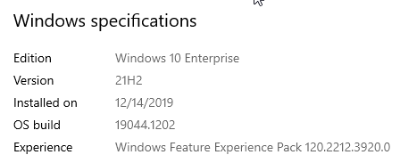
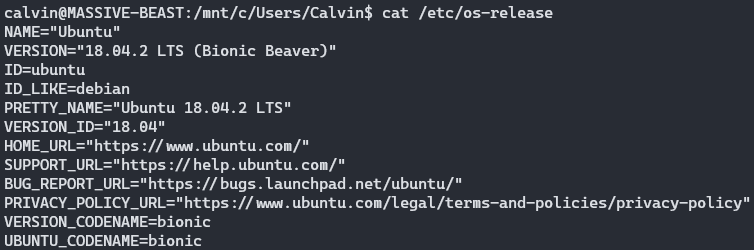

Docker Desktop just announced/released their new subscription model, and it hasn't sat well with many folks.  The good news is there are ways around it, even on Windows.

To get started, I'm running Windows 10 and have WSL2 installed running Ubuntu.  Even more specifically:






This likely works across multiple versions of each of these items, but just want you to know up front :).

Okay, so how do we get this working?  Here we go.

First, open an instance of WSL2, because we need to type a number of commands.

If you've ever had Docker installed inside of WSL2 before, and is now potentially an "old" version - remove it:

```bash
sudo apt-get remove docker docker-engine docker.io containerd runc
```

Now, let's update `apt` so we can get the current goodies:

```bash
sudo apt-get update

sudo apt-get install apt-transport-https ca-certificates curl gnupg lsb-release
```

Once thats finished, let's add the official GPG key for Docker:

```bash
curl -fsSL https://download.docker.com/linux/ubuntu/gpg | sudo gpg --dearmor -o /usr/share/keyrings/docker-archive-keyring.gpg
```

Now, let's add the **stable** repository to `apt`:

```bash
echo \
     "deb [arch=amd64 signed-by=/usr/share/keyrings/docker-archive-keyring.gpg] https://download.docker.com/linux/ubuntu \
     $(lsb_release -cs) stable" | sudo tee /etc/apt/sources.list.d/docker.list > /dev/null
```

Now we can actually install Docker! Run the following commands:

```bash
sudo apt-get update
sudo apt-get install docker-ce docker-ce-cli containerd.io
```

Docker is now installed! Yay!  And, I'm dumb, so I thought that was all, so I navigated to my source code directory and ran

```bash
docker-compose up
```

The error messages following that made me realize that I still need to install docker-compose, so here we go!

Since we've got everything updated and looking good, this part is just a single command:

```bash
sudo apt-get install docker-compose
```

Now, some caveats:

Docker isn't always running by default when you launch WSL2.  You can likely add it as a service to autostart, but I haven't done that (yet). For now
I just run the following command with every new session:

```bash
sudo service docker start
```

The version in my `docker-compose.yml` file was higher (because of Docker Desktop) than what is allowed with the current version of docker-compose
within WSL2.  I wasn't using anything special, so I was able to simply "downgrade" the version in the compose file without issue.

My containers are coming from our private registery in AWS ECR.  Because of that, I also had to install the AWS CLI tools and get that authentication
working before docker-compose would actually start up given my compose file. If you're interested, those commands are:

```bash
sudo apt-get install awscli
aws configure #answer the prompts to setup your profile
aws ecr get-login-password --region us-east-2 | docker login --username AWS --password-stdin <aws_account_number>.dkr.ecr.us-east-2.amazonaws.com
```

Once I did that, everything was good to go, and I was able to uninstall Docker Desktop.

Good luck, readers!

---

>This post, "Installing Docker, and Docker-Compose, in WSL2/Ubuntu on Windows", first appeared on [https://www.codingwithcalvin.net/installing-docker-and-docker-compose-in-wsl2ubuntu-on-windows](https://www.codingwithcalvin.net/installing-docker-and-docker-compose-in-wsl2ubuntu-on-windows)
